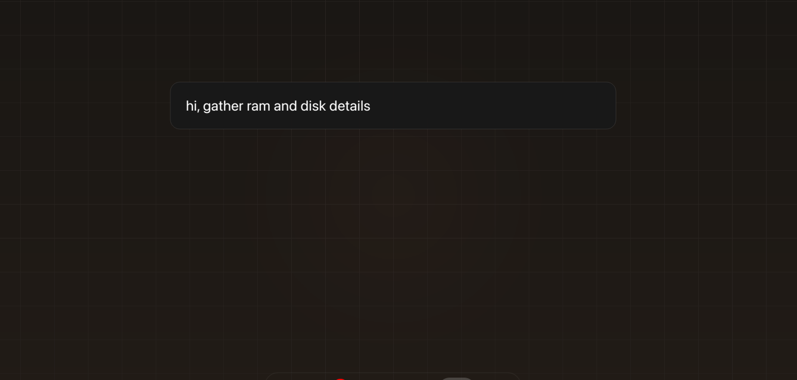
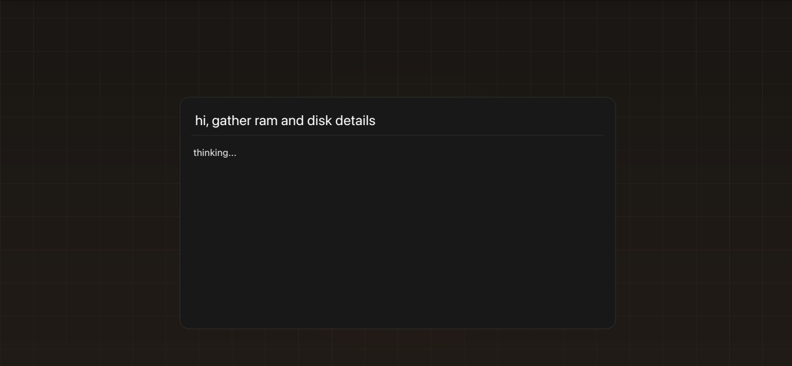
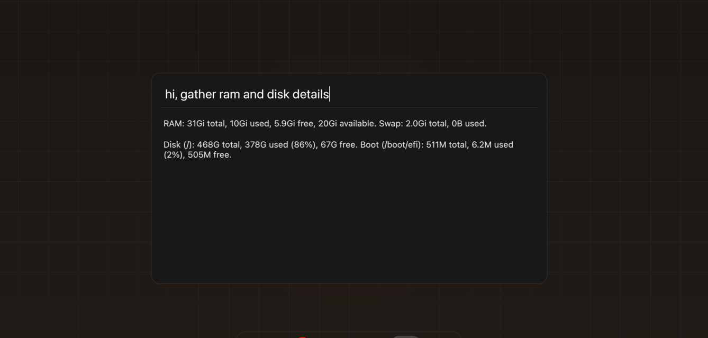

# Spotlight AI

A macOS Spotlight-style AI bar for Linux. Press a hotkey, ask anything, get answers inline — without leaving your workflow.

Powered by [OpenCode](https://opencode.ai) with **200+ free and paid models** (DeepSeek, Gemini, Claude, Qwen, Kimi, GLM and more).

---

## Screenshots

**Type your question:**



**Thinking...**



**Answer inline:**



---

## Install

```bash
pip install spotlight-ai
spotlight-setup
```

That's it. `spotlight-setup` will:
- Install [OpenCode CLI](https://opencode.ai) automatically
- Install PyQt5 if missing
- Register your hotkey (default `Ctrl+Space`, or pick your own)

---

## Usage

| Command | What it does |
|---|---|
| `spotlight` | Launch the bar |
| `spotlight --help` | Show help |
| `spotlight-setup` | First-time setup (install deps + hotkey) |
| `spotlight-keybind` | Register `Ctrl+Space` hotkey |
| `spotlight-keybind "<Super>space"` | Register a custom hotkey |
| `spotlight-help` | Show all commands |

### Custom hotkeys

```bash
spotlight-keybind                        # Ctrl+Space  (default)
spotlight-keybind "<Super>space"         # Win+Space
spotlight-keybind "<Alt>space"           # Alt+Space
spotlight-keybind "<Control><Shift>s"    # Ctrl+Shift+S
```

---

## Slash commands (inside the bar)

| Command | What it does |
|---|---|
| `/help` | Show slash command menu |
| `/model` | Show current active model |
| `/models` | List all available models (fetched live) |
| `/<alias>` | Switch model — e.g. `/gemini-2.5-flash` |
| `/<alias> <prompt>` | Switch + ask in one shot |

Model aliases are auto-derived from model IDs (last segment, lowercase). No hardcoded list — when OpenCode adds new models, they appear automatically.

**Examples:**
```
/deepseek-v4-flash-free
/gemini-2.5-flash what is a monad?
/claude-sonnet-4.6 write a regex for email
/kimi-k2-instruct explain async/await in 3 lines
```

Active model persists in `~/.spotlight/config.json`.

---

## How it works

```
hotkey pressed
  └─▶ PyQt5 frameless dark overlay appears (center of screen)
        └─▶ you type, press Enter
              └─▶ opencode run --format json -m <model> "<prompt>"
                    └─▶ answer appears in the bar
                          └─▶ press Esc to close
```

Slash commands are parsed before sending to OpenCode. Model switches are instant and persistent.

---

## Requirements

- Linux (GNOME for hotkey auto-registration; other DEs work manually)
- Python 3.10+
- [OpenCode CLI](https://opencode.ai) — installed automatically by `spotlight-setup`
- PyQt5 — installed automatically by `spotlight-setup`

---

## Files

```
spotlight_ai/
  cli.py        entry points: spotlight, spotlight-setup, spotlight-keybind, spotlight-help
  ui.py         PyQt5 frameless window — search bar + result area + animations
  opencode.py   subprocess wrapper around opencode CLI
  slash.py      slash command parser — live model list, persistent config
```

---

## Why not just use the terminal?

`hotkey → type → read` beats switching windows, typing a long command, and scrolling output. Spotlight stays on top, answers inline, and disappears with `Esc`. Works from anywhere — full-screen apps, browsers, anything.

---

Built with [OpenCode](https://opencode.ai) + PyQt5. Inspired by macOS Spotlight.

**PyPI:** [spotlight-ai](https://pypi.org/project/spotlight-ai/) · **GitHub:** [santhoshkammari/spotlight-ai](https://github.com/santhoshkammari/spotlight-ai)
